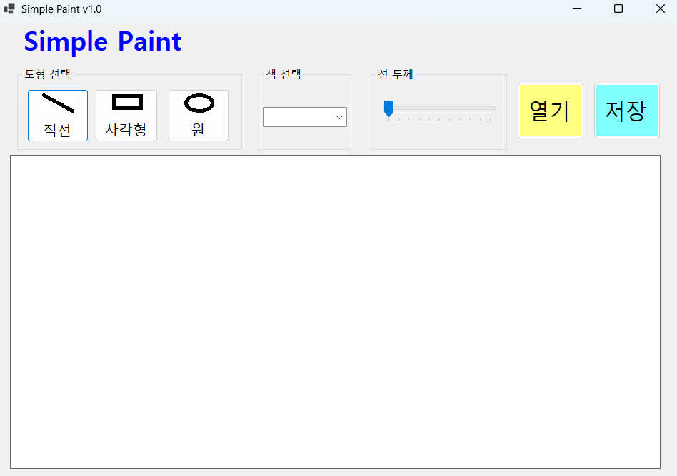
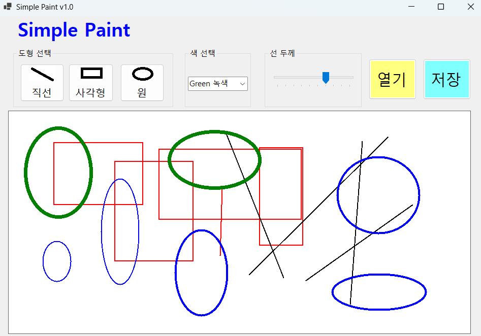
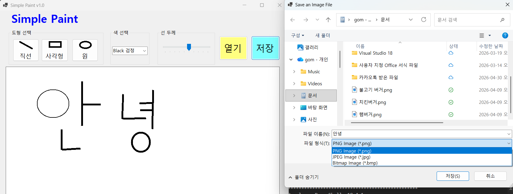

# (C# 코딩) SimplePaint

## 개요
-C# 프로그래밍학습  
-1줄소개: 나만의 그림판 만들기  
-사용한플랫폼: C#, .NET Windows Forms, Visual Studio, GitHub  
-사용한컨트롤:label, combobox, TrackBar, Button, GroupBox  
-구현한기능  
visual studio를 이용한 그림판 ui제작
Bitmap 기반 캔버스를 이해하고 마우스 이벤트 기반의 도형 그리기  
캔버스를 준비하고(이미지 파일 사용가능) 그 위에 그림을 그리고 그 결과를 이미지 파일로 저장가능하다.  
마우스 드래그를 통해서 그림을 그리고 이미지를 읽고 저장할 수있다.  
그림을 파일로 저장할 수 있게하고 .png, .jpg, .bmp 세가지 포맷으로 저장 가능하게 했다.  
외부 이미지를 가져와서 그 이미지 위에 그림을 그릴 수 있도록 하고 그 그림을 저장하는 기능 구현하였다.  
색상 선택(ComboBox)과 선 굵기 조절(TrackBar) 기능을 구현하였다.

## 실행화면(과제1)
-과제1코드의실행스크린샷

-과제내용  
   그림판 앱(Simple Paint)의 기본 UI를 구성하고, 사용자가 도형, 색상, 선 굵기를 선택할 수 있도록 기능을 구현하는 것이다. 화면에는 앱 이름, 도형 선택 버튼, 색상 선택 콤보박스, 선 굵기 조절 트랙바, 파일 열기/저장 버튼, 그림을 표시할 PictureBox를 배치하였다.

-구현내용과 기능설명  
 Label을 사용하여 앱 제목인 Simple Paint를 표시하였다.  
 GroupBox 안에 직선, 사각형, 원 버튼을 배치하여 도형 선택 영역을 만들었다.  
 ComboBox를 이용하여 Black, Red, Blue, Green 중 하나의 색상을 선택할 수 있도록 하였다.  
 TrackBar를 이용하여 선 굵기를 조절할 수 있도록 하였다.  
 PictureBox를 배치하여 그림이 그려질 캔버스 영역을 구성하였다.  
 
 열기 버튼과 저장 버튼을 배치하여 이후 이미지 파일 불러오기와 저장 기능을 구현할 수 있도록 UI를 준비하였다.   
사용자는 도형 선택 버튼을 클릭하여 직선, 사각형, 원 중 하나를 선택할 수 있다.   선택된 도형은 프로그램 내부의 현재 도형 상태로 저장된다.   
색상 선택 콤보박스에서는 검정, 빨강, 파랑, 초록 중 하나를 선택할 수 있으며, 선택한 색상이 현재 그리기 색상으로 설정된다.    

## 실행화면(과제2)
-과제2코드의실행스크린샷

-과제내용  
마우스 드래그를 이용하여 캔버스에 도형을 직접 그릴 수 있는 기능을 구현하는 것이다. 사용자는 마우스를 누르고 드래그하는 동작을 통해 직선, 사각형, 원을 자유롭게 그릴 수 있다.

-구현내용과 기능설명  
PictureBox를 캔버스로 사용하고 Bitmap 객체를 생성하여 그림이 저장되도록 구성하였다.  
Graphics 객체를 이용하여 Bitmap 위에 도형을 그릴 수 있도록 구현하였다.  
MouseDown 이벤트에서 드래그 시작 시점을 저장하였다.  
MouseMove 이벤트에서 마우스 이동에 따라 현재 위치를 갱신하고, Paint 이벤트를 통해 도형의 미리보기를 표시하였다.  
MouseUp 이벤트에서 드래그 종료 시 실제 Bitmap에 도형을 그려 확정하였다.  

현재 선택된 도형(Line, Rectangle, Circle)에 따라 switch문을 사용하여 서로 다른 도형을 그리도록 구현하였다.  
사용자가 마우스를 누르면 시작 좌표가 저장되고, 마우스를 이동시키는 동안 현재 좌표가 계속 업데이트된다.   
마우스를 놓으면 시작점과 끝점을 기준으로 선택된 도형이 Bitmap에 실제로 그려지고, PictureBox를 통해 화면에 출력된다. 

## 실행화면(과제3)
-과제3코드의실행스크린샷

-과제내용  
캔버스에 그린 그림을 이미지 파일로 저장하는 기능을 구현하는 것이다.  
사용자는 저장 버튼을 클릭하여 현재까지 그린 내용을 파일 형태로 저장할 수 있다.  

-구현내용과 기능설명   
SaveFileDialog를 사용하여 사용자가 저장할 파일의 경로와 이름을 선택할 수 있도록 구현하였다.  
파일 형식은 .png, .jpg, .bmp 세 가지로 선택할 수 있도록 설정하였다.  
PictureBox에 표시된 Bitmap 이미지를 가져와 파일로 저장하도록 구현하였다.  
선택된 파일 형식에 맞게 ImageFormat을 지정하여 저장 기능을 완성하였다.  

사용자가 저장 버튼을 클릭하면 SaveFileDialog 창이 나타나고, 파일 이름과 저장 경로를 지정할 수 있다.   
저장 형식으로 PNG, JPG, BMP 중 하나를 선택할 수 있으며, 선택이 완료되면 현재 캔버스에 그려진 그림이 해당 형식의 이미지 파일로 저장된다. 

## 실행화면(과제4)
-과제4코드의실행스크린샷

-과제내용
 

-구현내용과기능설명
   